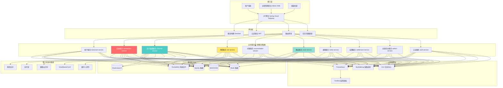
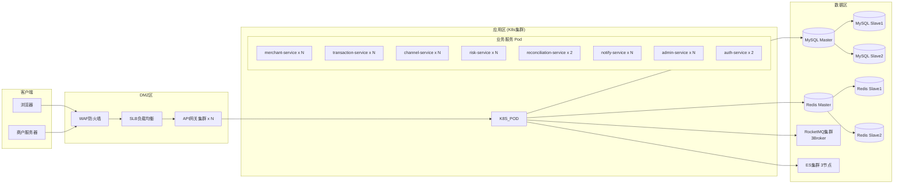
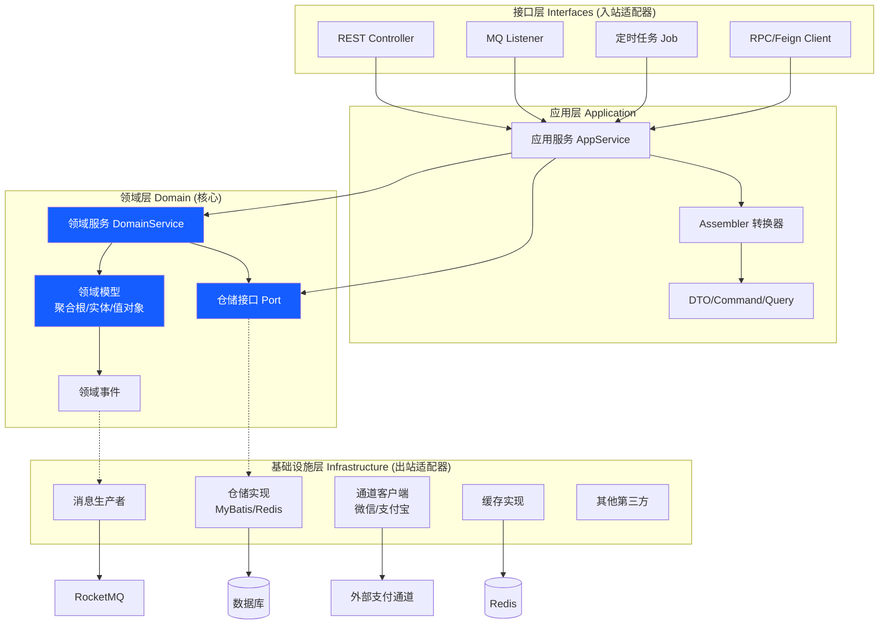
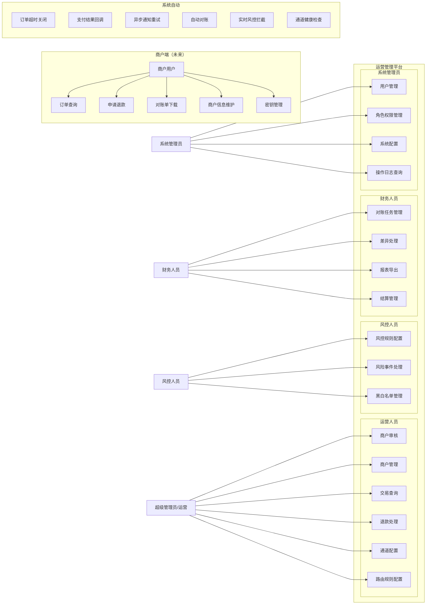
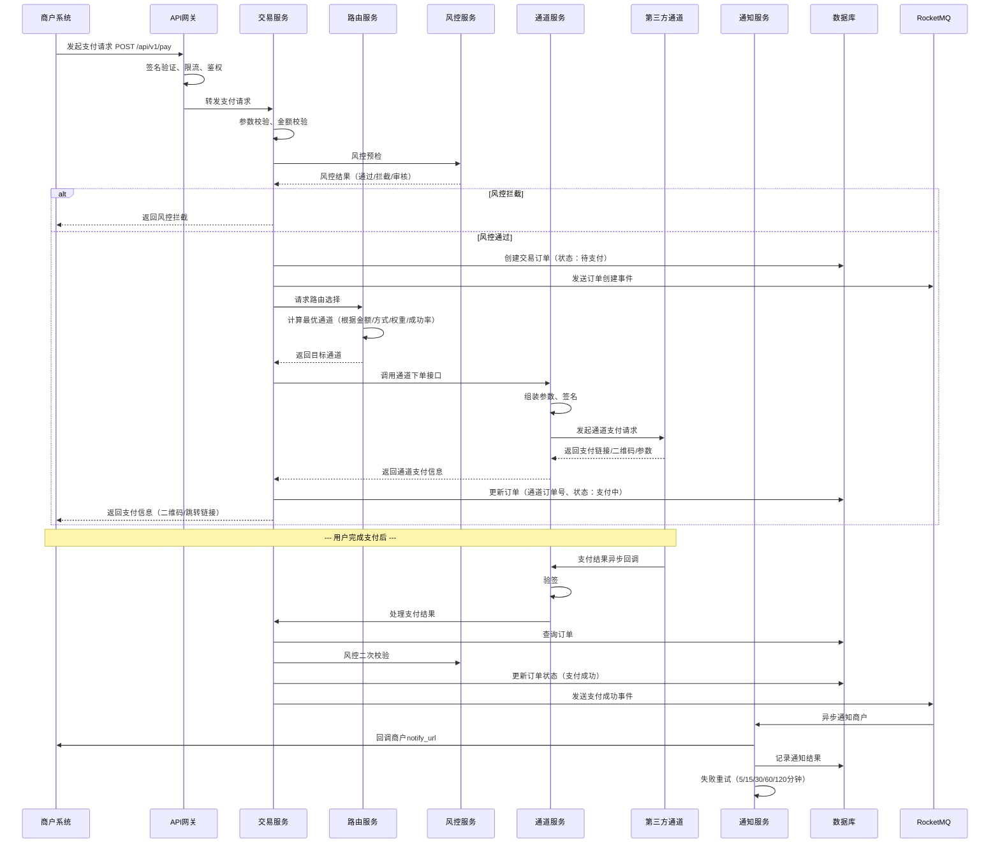
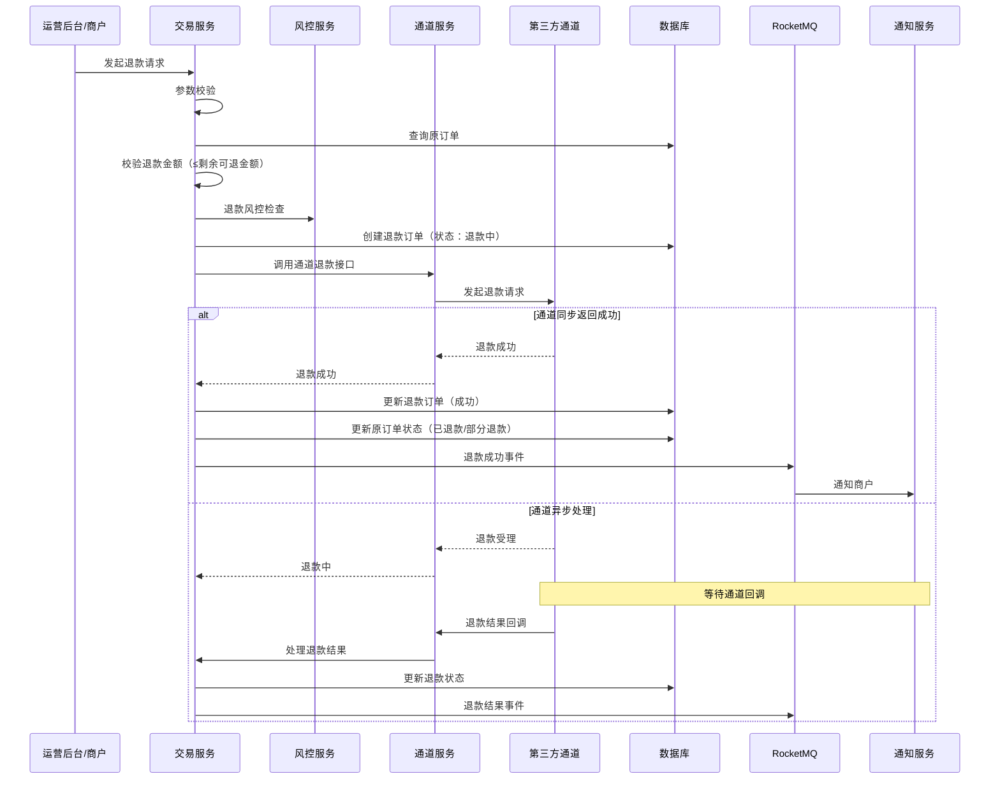
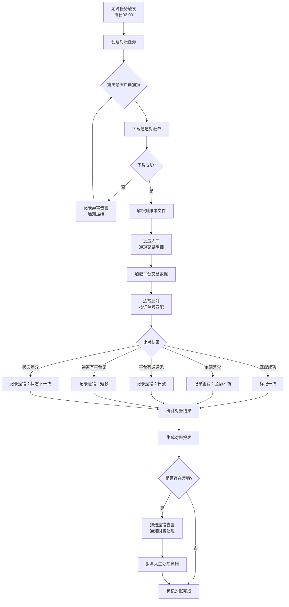
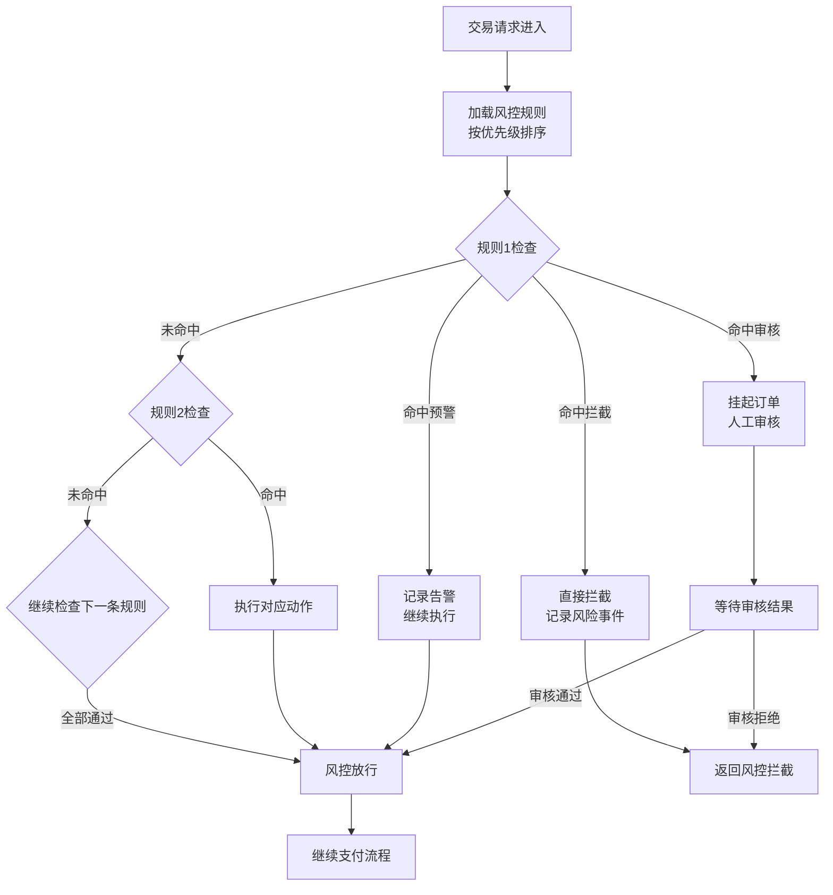
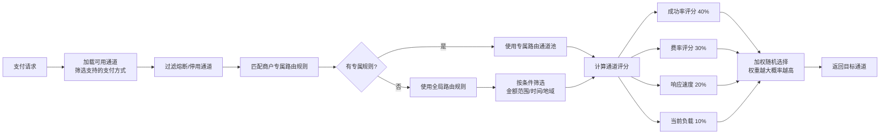

# 后端技术设计文档

**文档版本**：v1.0
**最后更新**：2026-06-30
**项目名称**：PayGateway 企业支付网关
**文档状态**：✅ 已完成

---

## 1. 技术栈选型

### 1.1 核心框架

| 分类 | 技术选型 | 版本 | 选型理由 |
|------|----------|------|----------|
| 开发语言 | Java | 21 (LTS) | 支付行业最成熟语言，生态完善，虚拟线程支持高并发 |
| 应用框架 | Spring Boot | 3.3.x | 开箱即用，自动配置，企业级标准 |
| 微服务框架 | Spring Cloud Alibaba | 2023.x | 国内生态成熟，Nacos/Sentinel/Seata一站式方案 |
| ORM框架 | MyBatis-Plus | 3.5.x | 灵活SQL控制，分页插件，代码生成，适合支付复杂查询 |
| 数据库连接池 | HikariCP | 5.x | Spring Boot默认，性能最优 |
| 服务注册/配置中心 | Nacos | 2.3.x | 注册+配置一体化，支持灰度、动态配置推送 |
| API网关 | Spring Cloud Gateway | 4.1.x | 响应式、高性能路由、限流、鉴权 |
| 分布式事务 | Seata | 1.8.x | AT/TCC模式，支持金融级数据一致性 |
| 服务限流熔断 | Sentinel | 1.8.x | 流量控制、熔断降级、热点参数限流 |

### 1.2 数据存储

| 分类 | 技术选型 | 版本 | 用途 |
|------|----------|------|------|
| 关系型数据库 | MySQL | 8.0 | 交易、商户、订单等核心数据（主从+分库分表） |
| 缓存 | Redis | 7.x | 会话、Token、限流计数器、热数据缓存、分布式锁 |
| 消息队列 | RocketMQ | 5.x | 交易异步通知、对账任务、日志投递（金融级可靠消息） |
| 搜索引擎 | Elasticsearch | 8.x | 订单/日志/风控事件全文检索、聚合分析 |
| 时序数据库 | InfluxDB | 2.x | 监控指标、QPS/响应时间等时序数据存储 |

### 1.3 基础设施

| 分类 | 技术选型 | 用途 |
|------|----------|------|
| 容器化 | Docker + Kubernetes | 服务容器化部署、弹性伸缩 |
| CI/CD | Jenkins + GitLab CI | 自动化构建、测试、部署 |
| 日志 | ELK Stack (Elasticsearch + Logstash + Kibana) | 分布式日志收集、查询、分析 |
| 监控 | Prometheus + Grafana | 系统指标采集、可视化监控告警 |
| 链路追踪 | Apache SkyWalking | 分布式链路追踪、性能分析 |
| API文档 | SpringDoc OpenAPI (Swagger) | 自动生成接口文档 |
| 对象存储 | MinIO / 阿里云OSS | 证书文件、对账单、报表存储 |

### 1.4 安全组件

| 分类 | 技术选型 | 用途 |
|------|----------|------|
| 认证 | JWT + Spring Security | Token认证、RBAC权限 |
| 加密 | Jasypt / BouncyCastle | 敏感字段加密（AES-256/RSA） |
| 接口签名 | HMAC-SHA256 | 防篡改、防重放 |
| 防火墙 | WAF + Sentinel | Web应用防火墙、接口限流 |

### 1.5 工具库

| 分类 | 技术选型 | 用途 |
|------|----------|------|
| JSON处理 | Jackson | JSON序列化/反序列化 |
| 工具类 | Hutool | 通用工具方法 |
| 日期处理 | Java Time (JSR-310) | JDK8+原生日期API |
| HTTP客户端 | OkHttp / WebClient | 调用第三方支付通道接口 |
| 校验 | Hibernate Validator | 参数校验 |
| Excel处理 | EasyExcel | 对账报表导入导出 |
| 二维码生成 | ZXing | 扫码支付二维码生成 |

---

## 2. 系统架构

### 2.1 整体架构图



### 2.2 部署架构图



---

## 3. 微服务拆分

| 服务名 | 服务职责 | 端口 | 数据库 | 重要性 |
|--------|----------|------|--------|--------|
| auth-service | 用户认证、Token管理、RBAC权限 | 8001 | paygateway_auth | P0 |
| admin-service | 运营后台管理接口（系统配置、用户管理、操作日志） | 8002 | paygateway_admin | P0 |
| merchant-service | 商户入驻、审核、商户信息管理、费率配置 | 8003 | paygateway_merchant（分库） | P0 |
| transaction-service | 交易订单创建、支付、退款、订单查询（核心交易链路） | 8004 | paygateway_transaction（分库分表） | P0 |
| channel-service | 支付通道配置、通道对接、通道状态管理、请求签名/验签 | 8005 | paygateway_channel | P0 |
| route-service | 智能路由、通道选择、权重计算 | 8006 | paygateway_route | P0 |
| risk-service | 风控规则引擎、实时风控拦截、黑白名单、风险事件 | 8007 | paygateway_risk | P0 |
| notify-service | 支付结果异步通知、商户回调、通知重试、消息推送 | 8008 | paygateway_notify | P1 |
| reconciliation-service | 对账文件下载、解析、差错比对、对账报表 | 8009 | paygateway_reconciliation | P1 |
| settlement-service | 资金结算、分账、商户出金 | 8010 | paygateway_settlement | P1 |

---

## 4. 项目结构（DDD六边形架构）

采用**DDD领域驱动设计 + 六边形架构（端口适配器模式）**，每个微服务独立代码库，统一遵循以下结构：

### 4.1 单服务目录结构

```
paygateway-transaction/
├── pom.xml
├── src/
│   ├── main/
│   │   ├── java/com/paygateway/transaction/
│   │   │   ├── TransactionApplication.java          # 启动类
│   │   │   │
│   │   │   ├── domain/                             # 领域层（核心业务）
│   │   │   │   ├── model/                          # 领域模型（聚合根、实体、值对象）
│   │   │   │   │   ├── TradeOrder.java             # 交易订单聚合根
│   │   │   │   │   ├── TradeOrderItem.java         # 订单明细实体
│   │   │   │   │   ├── RefundOrder.java            # 退款订单聚合根
│   │   │   │   │   ├── Money.java                  # 金额值对象
│   │   │   │   │   ├── OrderStatus.java            # 状态枚举
│   │   │   │   │   └── PayType.java                # 支付方式枚举
│   │   │   │   ├── service/                        # 领域服务
│   │   │   │   │   ├── TradeOrderDomainService.java
│   │   │   │   │   └── RefundDomainService.java
│   │   │   │   └── repository/                     # 仓储接口（端口）
│   │   │   │       ├── TradeOrderRepository.java
│   │   │   │       └── RefundOrderRepository.java
│   │   │   │
│   │   │   ├── application/                        # 应用层
│   │   │   │   ├── service/                        # 应用服务（用例编排）
│   │   │   │   │   ├── TradeOrderAppService.java
│   │   │   │   │   ├── TradeQueryAppService.java
│   │   │   │   │   └── RefundAppService.java
│   │   │   │   ├── dto/                            # 数据传输对象
│   │   │   │   │   ├── request/
│   │   │   │   │   └── response/
│   │   │   │   ├── assembler/                      # DTO转换器
│   │   │   │   └── command/                        # 命令对象（CQRS可选）
│   │   │   │
│   │   │   ├── interfaces/                         # 接口层（适配器）
│   │   │   │   ├── api/                            # REST API接口（入站适配器）
│   │   │   │   │   ├── TradeOrderController.java
│   │   │   │   │   └── TradeQueryController.java
│   │   │   │   ├── listener/                       # MQ消息监听（入站适配器）
│   │   │   │   │   ├── ChannelCallbackListener.java
│   │   │   │   │   └── PaymentNotifyListener.java
│   │   │   │   └── job/                            # 定时任务（入站适配器）
│   │   │   │       └── OrderTimeoutJob.java
│   │   │   │
│   │   │   └── infrastructure/                     # 基础设施层
│   │   │       ├── repository/                     # 仓储实现（出站适配器）
│   │   │       │   ├── TradeOrderRepositoryImpl.java
│   │   │       │   └── mapper/                     # MyBatis Mapper
│   │   │       │       └── TradeOrderMapper.java
│   │   │       ├── channel/                        # 通道调用客户端（出站适配器）
│   │   │       │   ├── ChannelClient.java
│   │   │       │   ├── WechatPayClient.java
│   │   │       │   └── AlipayClient.java
│   │   │       ├── mq/                             # 消息发送（出站适配器）
│   │   │       │   └── TransactionProducer.java
│   │   │       ├── cache/                          # 缓存实现
│   │   │       │   └── TradeOrderCache.java
│   │   │       ├── config/                         # 配置类
│   │   │       │   ├── MyBatisConfig.java
│   │   │       │   ├── RocketMQConfig.java
│   │   │       │   └── ThreadPoolConfig.java
│   │   │       └── util/                           # 工具类
│   │   │
│   │   └── resources/
│   │       ├── application.yml                     # 主配置
│   │       ├── application-dev.yml                 # 开发环境
│   │       ├── application-prod.yml                # 生产环境
│   │       ├── mapper/                             # MyBatis XML
│   │       │   └── TradeOrderMapper.xml
│   │       └── logback-spring.xml                  # 日志配置
│   │
│   └── test/
│       └── java/com/paygateway/transaction/        # 单元测试/集成测试
├── Dockerfile
└── README.md
```

### 4.2 分层依赖关系（六边形架构）



**依赖规则**：
- 外层依赖内层，内层不感知外层
- Domain层是核心，不依赖任何框架
- 接口层接收外部请求，调用应用服务
- 应用服务编排领域服务和仓储完成用例
- 基础设施层实现领域层定义的端口接口

---

## 5. 数据模型设计

### 5.1 ER关系总览

```mermaid
erDiagram
    MERCHANT ||--o{ MERCHANT_STORE : has
    MERCHANT ||--o{ MERCHANT_RATE : has
    MERCHANT ||--o{ TRADE_ORDER : creates
    MERCHANT ||--o{ REFUND_ORDER : creates
    MERCHANT ||--o{ MERCHANT_SETTLE : has

    CHANNEL ||--o{ CHANNEL_CONFIG : has
    CHANNEL ||--o{ CHANNEL_RATE : has
    CHANNEL ||--o{ CHANNEL_ROUTE_RULE : used_by

    TRADE_ORDER ||--o{ TRADE_LOG : has
    TRADE_ORDER ||--o| REFUND_ORDER : may_have
    TRADE_ORDER }o--|| CHANNEL : uses
    TRADE_ORDER }o--|| ROUTE_RECORD : records

    ROUTE_RULE ||--o{ ROUTE_TARGET : has

    RISK_RULE ||--o{ RISK_EVENT : triggers
    BLACKLIST }o--o{ RISK_EVENT : involved

    RECON_TASK ||--o{ RECON_DETAIL : contains
    RECON_TASK }o--|| CHANNEL : against

    SYS_USER ||--o{ SYS_ROLE : has
    SYS_ROLE ||--o{ SYS_PERMISSION : has
    SYS_USER ||--o{ OPERATION_LOG : produces

    NOTIFY_RECORD }o--|| TRADE_ORDER : for
    NOTIFY_RECORD }o--|| MERCHANT : to

    MERCHANT {
        bigint id PK
        varchar merchant_no UK
        varchar merchant_name
        tinyint status
        varchar contact_name
        varchar contact_phone
        varchar industry
        varchar business_license
        datetime created_at
        datetime updated_at
    }

    CHANNEL {
        bigint id PK
        varchar channel_code UK
        varchar channel_name
        tinyint channel_type
        tinyint status
        decimal avg_success_rate
        int avg_latency
        datetime created_at
    }

    TRADE_ORDER {
        bigint id PK
        varchar order_no UK
        varchar merchant_no FK
        bigint merchant_id FK
        varchar channel_code FK
        varchar channel_order_no
        varchar pay_type
        decimal amount
        decimal fee
        tinyint currency
        tinyint status
        varchar client_ip
        varchar subject
        varchar notify_url
        datetime expire_time
        datetime paid_at
        datetime created_at
        datetime updated_at
    }

    REFUND_ORDER {
        bigint id PK
        varchar refund_no UK
        varchar order_no FK
        varchar merchant_no
        decimal refund_amount
        decimal refund_fee
        varchar refund_reason
        tinyint status
        varchar channel_refund_no
        datetime refunded_at
        datetime created_at
    }

    ROUTE_RULE {
        bigint id PK
        varchar rule_name
        int priority
        json conditions
        tinyint status
        datetime created_at
    }

    ROUTE_TARGET {
        bigint id PK
        bigint rule_id FK
        varchar channel_code
        int weight
    }

    RISK_RULE {
        bigint id PK
        varchar rule_name
        varchar category
        json condition_expr
        varchar action
        tinyint status
        datetime created_at
    }

    RISK_EVENT {
        bigint id PK
        varchar event_no UK
        varchar category
        varchar risk_level
        varchar order_no
        varchar trigger_rule
        json event_detail
        tinyint status
        varchar handle_note
        datetime triggered_at
        datetime handled_at
    }

    RECON_TASK {
        bigint id PK
        varchar task_no
        date task_date
        varchar channel_code FK
        int channel_count
        decimal channel_amount
        int platform_count
        decimal platform_amount
        int diff_count
        decimal diff_amount
        tinyint status
        datetime completed_at
        datetime created_at
    }

    SYS_USER {
        bigint id PK
        varchar username UK
        varchar password
        varchar real_name
        varchar role_code
        tinyint status
        datetime last_login_time
        datetime created_at
    }

    NOTIFY_RECORD {
        bigint id PK
        varchar notify_no
        varchar order_no
        varchar merchant_no
        tinyint notify_type
        text request_body
        text response_body
        tinyint status
        int retry_count
        datetime next_retry_time
        datetime last_notify_time
        datetime created_at
    }
```

### 5.2 核心表详细设计

#### 5.2.1 商户表（merchant_info）

| 字段名 | 类型 | 说明 | 约束 |
|--------|------|------|------|
| id | BIGINT | 主键 | PK, AUTO_INCREMENT |
| merchant_no | VARCHAR(32) | 商户号 | UK, NOT NULL（格式：M+序号） |
| merchant_name | VARCHAR(128) | 商户名称 | NOT NULL |
| short_name | VARCHAR(64) | 商户简称 | |
| industry | VARCHAR(32) | 行业分类 | NOT NULL |
| business_license | VARCHAR(64) | 营业执照号 | |
| legal_person | VARCHAR(32) | 法人姓名 | |
| contact_name | VARCHAR(32) | 联系人姓名 | NOT NULL |
| contact_phone | VARCHAR(20) | 联系电话（加密存储） | NOT NULL |
| contact_email | VARCHAR(64) | 联系邮箱（加密存储） | |
| status | TINYINT | 状态 | NOT NULL, 0待审核/1正常/2冻结/3禁用/4驳回 |
| level | TINYINT | 商户等级 | 1-5 |
| auth_status | TINYINT | 认证状态 | 0未认证/1已认证 |
| settle_cycle | TINYINT | 结算周期 | T+1/T+7等 |
| risk_level | TINYINT | 风险等级 | 1低/2中/3高 |
| daily_limit | DECIMAL(15,2) | 日限额 | 默认5000000 |
| single_limit | DECIMAL(15,2) | 单笔限额 | 默认100000 |
| remark | VARCHAR(512) | 备注 | |
| created_at | DATETIME | 创建时间 | NOT NULL |
| updated_at | DATETIME | 更新时间 | NOT NULL |
| INDEX | idx_merchant_name(merchant_name) | 名称索引 | |
| INDEX | idx_status(status) | 状态索引 | |
| INDEX | idx_created_at(created_at) | 时间索引 | |

#### 5.2.2 交易订单表（trade_order）- 分库分表

**分库分表策略**：按`merchant_id`哈希分库（4库），按`created_at`月份分表（每库12张表）

| 字段名 | 类型 | 说明 | 约束 |
|--------|------|------|------|
| id | BIGINT | 主键（雪花ID） | PK |
| order_no | VARCHAR(32) | 平台订单号 | UK, NOT NULL（PAY+yyyymmdd+序号） |
| merchant_order_no | VARCHAR(64) | 商户订单号 | NOT NULL |
| merchant_id | BIGINT | 商户ID | NOT NULL（分库键） |
| merchant_no | VARCHAR(32) | 商户号 | NOT NULL |
| channel_id | BIGINT | 通道ID | NOT NULL |
| channel_code | VARCHAR(32) | 通道编码 | NOT NULL |
| channel_order_no | VARCHAR(64) | 通道订单号 | （支付成功后回填） |
| channel_transaction_id | VARCHAR(64) | 通道流水号 | |
| pay_type | VARCHAR(20) | 支付方式 | JSAPI/NATIVE/H5/APP/PC/CREDIT_CARD |
| subject | VARCHAR(256) | 订单标题 | NOT NULL |
| body | TEXT | 订单描述 | |
| amount | DECIMAL(15,2) | 订单金额（元） | NOT NULL |
| actual_amount | DECIMAL(15,2) | 实际支付金额 | 支付成功后回填 |
| fee | DECIMAL(15,2) | 手续费 | 支付成功后回填 |
| fee_rate | DECIMAL(8,6) | 费率 | |
| currency | CHAR(3) | 币种 | 默认CNY |
| status | TINYINT | 订单状态 | NOT NULL, 0待支付/1支付中/2支付成功/3支付失败/4已关闭/5已退款/6部分退款 |
| client_ip | VARCHAR(45) | 客户端IP | NOT NULL |
| notify_url | VARCHAR(256) | 支付结果回调地址 | |
| return_url | VARCHAR(256) | 页面跳转地址 | |
| expire_time | DATETIME | 订单过期时间 | NOT NULL（默认创建后30分钟） |
| paid_at | DATETIME | 支付完成时间 | |
| channel_response | TEXT | 通道响应原始数据 | |
| extra | JSON | 扩展字段（透传参数、openid等） | |
| created_at | DATETIME | 创建时间 | NOT NULL（分表键） |
| updated_at | DATETIME | 更新时间 | NOT NULL |
| INDEX | idx_merchant_order_no(merchant_id, merchant_order_no) | 商户订单号查询 | |
| INDEX | idx_channel_order_no(channel_code, channel_order_no) | 通道订单号查询 | |
| INDEX | idx_status_created(status, created_at) | 状态+时间查询 | |
| INDEX | idx_paid_at(paid_at) | 支付时间查询 | |

#### 5.2.3 退款订单表（refund_order）- 分库分表

| 字段名 | 类型 | 说明 | 约束 |
|--------|------|------|------|
| id | BIGINT | 雪花ID | PK |
| refund_no | VARCHAR(32) | 退款单号 | UK（REF+yyyymmdd+序号） |
| order_no | VARCHAR(32) | 原支付订单号 | NOT NULL |
| merchant_id | BIGINT | 商户ID | NOT NULL（分库键） |
| merchant_no | VARCHAR(32) | 商户号 | NOT NULL |
| channel_code | VARCHAR(32) | 通道编码 | NOT NULL |
| channel_refund_no | VARCHAR(64) | 通道退款单号 | |
| refund_amount | DECIMAL(15,2) | 退款金额 | NOT NULL |
| refund_fee | DECIMAL(15,2) | 退款手续费 | |
| refund_reason | VARCHAR(256) | 退款原因 | NOT NULL |
| status | TINYINT | 退款状态 | 0退款中/1退款成功/2退款失败 |
| channel_response | TEXT | 通道响应 | |
| refunded_at | DATETIME | 退款完成时间 | |
| created_at | DATETIME | 创建时间 | NOT NULL |
| updated_at | DATETIME | 更新时间 | NOT NULL |
| INDEX | idx_order_no(order_no) | 原订单号索引 | |
| INDEX | idx_status_created(status, created_at) | | |

#### 5.2.4 支付通道配置表（channel_config）

| 字段名 | 类型 | 说明 | 约束 |
|--------|------|------|------|
| id | BIGINT | 主键 | PK |
| channel_code | VARCHAR(32) | 通道编码 | UK（WECHAT/ALIPAY/UNIONPAY/VISA等） |
| channel_name | VARCHAR(64) | 通道名称 | NOT NULL |
| channel_type | TINYINT | 通道类型 | 1第三方支付/2银行直连/3数字货币 |
| pay_types | VARCHAR(256) | 支持支付方式（逗号分隔） | NOT NULL |
| app_id | VARCHAR(64) | 应用ID | 加密存储 |
| mch_id | VARCHAR(32) | 商户号 | 加密存储 |
| api_key | TEXT | API密钥 | AES加密存储 |
| cert_path | VARCHAR(256) | 证书路径 | |
| private_key | TEXT | 私钥 | AES加密存储 |
| public_key | TEXT | 公钥 | |
| notify_url | VARCHAR(256) | 回调地址 | |
| status | TINYINT | 状态 | 0停用/1启用 |
| priority | INT | 优先级 | 默认100 |
| weight | INT | 权重 | 路由权重 |
| avg_success_rate | DECIMAL(5,2) | 平均成功率（最近1小时） | 定时任务更新 |
| avg_latency | INT | 平均响应时间(ms) | 定时任务更新 |
| current_qps | INT | 当前QPS | 实时更新 |
| daily_amount | DECIMAL(18,2) | 今日交易额 | 定时重置 |
| daily_count | INT | 今日交易笔数 | 定时重置 |
| config | JSON | 扩展配置 | 限频、超时时间等 |
| created_at | DATETIME | 创建时间 | |
| updated_at | DATETIME | 更新时间 | |

#### 5.2.5 风控规则表（risk_rule）

| 字段名 | 类型 | 说明 | 约束 |
|--------|------|------|------|
| id | BIGINT | 主键 | PK |
| rule_code | VARCHAR(64) | 规则编码 | UK |
| rule_name | VARCHAR(128) | 规则名称 | NOT NULL |
| category | VARCHAR(32) | 规则分类 | TRADE_LIMIT/FREQUENCY/IP/DEVICE/GEO/BLACKLIST |
| condition_expr | JSON | 条件表达式 | NOT NULL |
| action | VARCHAR(20) | 触发动作 | BLOCK/REVIEW/ALERT |
| risk_level | VARCHAR(10) | 风险等级 | HIGH/MEDIUM/LOW |
| priority | INT | 优先级 | 数值越小优先级越高 |
| status | TINYINT | 状态 | 0禁用/1启用 |
| effect_start | DATETIME | 生效开始时间 | |
| effect_end | DATETIME | 生效结束时间 | |
| description | VARCHAR(512) | 规则描述 | |
| created_at | DATETIME | 创建时间 | |
| updated_at | DATETIME | 更新时间 | |

**condition_expr 示例**：
```json
{
  "conditions": [
    { "field": "amount", "operator": "GT", "value": 100000 },
    { "field": "client_ip", "operator": "IN", "value": "${blacklist_ips}" }
  ],
  "logic": "AND"
}
```

#### 5.2.6 对账任务表（recon_task）

| 字段名 | 类型 | 说明 | 约束 |
|--------|------|------|------|
| id | BIGINT | 主键 | PK |
| task_no | VARCHAR(32) | 任务编号 | UK |
| task_date | DATE | 对账日期 | NOT NULL |
| channel_code | VARCHAR(32) | 通道编码 | NOT NULL |
| channel_file_url | VARCHAR(512) | 通道对账单URL | |
| channel_count | INT | 通道交易笔数 | |
| channel_amount | DECIMAL(18,2) | 通道交易金额 | |
| platform_count | INT | 平台交易笔数 | |
| platform_amount | DECIMAL(18,2) | 平台交易金额 | |
| diff_count | INT | 差异笔数 | |
| diff_amount | DECIMAL(18,2) | 差异金额 | |
| success_count | INT | 对账成功笔数 | |
| status | TINYINT | 任务状态 | 0待处理/1下载中/2解析中/3比对中/4完成/5异常 |
| error_msg | VARCHAR(1024) | 错误信息 | |
| started_at | DATETIME | 开始时间 | |
| completed_at | DATETIME | 完成时间 | |
| created_at | DATETIME | 创建时间 | |
| UNIQUE KEY | uk_date_channel(task_date, channel_code) | 单日单通道唯一 | |

---

## 6. 用例图



---

## 7. 核心业务流程图

### 7.1 支付主流程



### 7.2 退款流程



### 7.3 对账流程



### 7.4 实时风控流程



---

## 8. 关键技术点与难点

### 8.1 支付安全（PCI-DSS合规）

| 技术点 | 方案 |
|--------|------|
| 敏感数据加密 | AES-256加密存储手机号、邮箱、密钥；RSA加密传输银行卡号 |
| 密钥管理 | 密钥存储在KMS/配置中心，不硬编码；定期轮换；证书文件权限最小化 |
| 接口防篡改 | 所有接口HMAC-SHA256签名，timestamp+nonce防重放 |
| 接口鉴权 | JWT + API Key双重认证；RBAC权限控制到按钮级 |
| 敏感信息脱敏 | 日志、接口响应中手机号/银行卡号脱敏显示（138****8888） |
| SQL注入防护 | MyBatis参数化查询，禁止拼接SQL |
| XSS防护 | 网关层统一过滤；响应头Content-Security-Policy |
| 审计日志 | 所有敏感操作记录审计日志，不可篡改 |

### 8.2 高并发交易处理

| 技术点 | 方案 |
|--------|------|
| 异步化 | 支付通知、日志、风控事件通过RocketMQ异步处理，主链路只做核心逻辑 |
| 缓存策略 | Redis缓存商户信息、通道配置、路由规则、风控黑白名单（减少DB查询） |
| 分库分表 | 交易表/退款表按商户ID哈希分4库，按创建时间分12表/库；ShardingSphere实现 |
| 读写分离 | MySQL一主两从，写操作走主库，读操作（查询/报表）走从库 |
| 连接池优化 | HikariCP优化：最大连接数=CPU核数*2 + 磁盘数；合理设置超时 |
| 线程池隔离 | 不同通道使用独立线程池，避免单通道故障影响全部 |
| 限流降级 | Sentinel接口限流：单商户QPS、单IP QPS、全局QPS；通道故障时自动降级 |
| 幂等设计 | 商户订单号唯一索引；支付/退款接口支持幂等重复调用 |

### 8.3 分布式事务一致性

| 场景 | 方案 |
|--------|------|
| 订单创建+路由+通道调用 | TCC模式（Try预留资源、Confirm确认、Cancel取消） |
| 支付成功后的多表更新 | 本地消息表 + RocketMQ事务消息（最终一致性） |
| 退款扣减+退款记录 | Seata AT模式（自动补偿） |
| 对账差错处理 | 人工审核+状态机驱动，避免自动修复导致资金问题 |

**幂等设计要点**：
```java
// 支付订单创建幂等伪代码
public PayResponse createPayOrder(PayRequest request) {
    // 1. 先查是否已存在
    TradeOrder exist = orderMapper.selectByMerchantOrderNo(
        request.getMerchantId(), request.getMerchantOrderNo());
    if (exist != null) {
        // 已存在，直接返回（幂等返回）
        return buildResponse(exist);
    }
    // 2. 分布式锁防并发（防止同一毫秒重复请求）
    String lockKey = "pay:lock:" + request.getMerchantId() + ":" + request.getMerchantOrderNo();
    try {
        if (redisLock.tryLock(lockKey, 3, TimeUnit.SECONDS)) {
            // double check
            exist = orderMapper.selectByMerchantOrderNo(...);
            if (exist != null) return buildResponse(exist);
            // 创建订单...
        }
    } finally {
        redisLock.unlock(lockKey);
    }
}
```

### 8.4 智能路由引擎

路由决策因子：
1. **支付方式匹配**：只选择支持该支付方式的通道
2. **费率最优**：在同等条件下优先选择费率低的通道
3. **健康度**：成功率 < 95%的通道降低权重，成功率 < 90%自动熔断
4. **实时QPS**：不超过通道限流阈值
5. **商户费率配置**：商户专属路由优先于全局路由
6. **通道权重**：按配置比例分配流量



### 8.5 支付结果通知可靠性

| 技术点 | 方案 |
|--------|------|
| 通知可靠性 | RocketMQ可靠消息+本地通知记录表，不丢消息 |
| 重试策略 | 指数退避重试：5s/15s/30s/1min/2min/5min/15min/30min/60min/120min，最多10次 |
| 超时控制 | HTTP通知超时10秒，避免阻塞 |
| 成功判定 | 商户返回"success"字符串或HTTP 2xx且body含SUCCESS |
| 重复通知 | 商户需做幂等处理，通知携带重复标记 |
| 通知查询 | 提供接口供商户主动查询订单状态，作为兜底 |

### 8.6 自动对账准确性

| 技术点 | 方案 |
|--------|------|
| 对账文件解析 | 适配器模式，每个通道独立解析器（微信/支付宝/银联格式各不相同） |
| 逐笔对账 | 以通道订单号/平台订单号双向匹配 |
| 差错类型 | 金额不符、长款（平台有通道无）、短款（通道有平台无）、状态不一致 |
| 容错机制 | 对账文件下载失败自动重试3次；解析容错跳过异常行记录告警 |
| 对账窗口 | 每日02:00执行T+1日对账；支持手动触发单日重新对账 |
| 数据量优化 | 批量查询、分批处理（每次1000条）、使用临时表比对 |

### 8.7 通道对接抽象设计

**策略模式**：每个支付通道实现统一的ChannelClient接口
```java
public interface ChannelClient {
    /** 获取通道编码 */
    String getChannelCode();

    /** 统一下单 */
    ChannelPayResponse unifiedOrder(ChannelPayRequest request);

    /** 订单查询 */
    ChannelQueryResponse orderQuery(ChannelQueryRequest request);

    /** 申请退款 */
    ChannelRefundResponse refund(ChannelRefundRequest request);

    /** 退款查询 */
    ChannelRefundQueryResponse refundQuery(ChannelRefundQueryRequest request);

    /** 关闭订单 */
    ChannelCloseResponse closeOrder(ChannelCloseRequest request);

    /** 验签回调 */
    boolean verifyNotify(Map<String, String> params, String sign);

    /** 解析回调数据 */
    ChannelNotifyResult parseNotify(Map<String, String> params);
}
```

每个通道实现类（WechatPayClient、AlipayClient、UnionPayClient）只关心自己的签名和参数转换，与业务解耦。新增通道只需添加实现类即可。

### 8.8 分布式锁

使用Redis + Lua脚本实现可重入分布式锁，应用场景：
- 同一商户订单并发创建防重
- 同一退款单并发退款防重
- 对账任务执行互斥
- 定时任务多实例部署时的leader选举

```lua
-- 加锁Lua脚本（原子操作）
if redis.call('exists', KEYS[1]) == 0 then
    redis.call('hset', KEYS[1], ARGV[1], 1);
    redis.call('pexpire', KEYS[1], ARGV[2]);
    return 1;
end;
if redis.call('hexists', KEYS[1], ARGV[1]) == 1 then
    redis.call('hincrby', KEYS[1], ARGV[1], 1);
    redis.call('pexpire', KEYS[1], ARGV[2]);
    return 1;
end;
return 0;
```

---

## 9. 接口设计规范

### 9.1 RESTful API规范

| HTTP方法 | 用途 | 示例 |
|----------|------|------|
| GET | 查询资源 | GET /api/v1/trade/orders?orderNo=xxx |
| POST | 创建资源 | POST /api/v1/trade/orders |
| PUT | 更新资源 | PUT /api/v1/merchants/{id} |
| DELETE | 删除资源 | DELETE /api/v1/risk/rules/{id} |

**统一响应格式**：
```json
{
  "code": 0,
  "message": "success",
  "data": {},
  "requestId": "req_20260630_abcdef",
  "timestamp": 1719705600000
}
```

**分页请求**：`?page=1&pageSize=20`
**分页响应**：
```json
{
  "list": [],
  "total": 100,
  "page": 1,
  "pageSize": 20,
  "totalPages": 5
}
```

### 9.2 签名规范（商户接口）

```
Signature = HMAC-SHA256(
    appId + timestamp + nonce + body,
    appSecret
).toHex()
```
请求头携带：
- `X-App-Id`: 商户应用ID
- `X-Timestamp`: 请求时间戳（毫秒）
- `X-Nonce`: 随机字符串（防重放，5分钟内nonce唯一）
- `X-Signature`: 签名结果

---

## 10. 监控与告警

### 10.1 关键监控指标

| 指标类别 | 具体指标 | 告警阈值 |
|----------|----------|----------|
| 系统指标 | CPU使用率、内存使用率、磁盘使用率 | CPU > 80% / 内存 > 85% |
| JVM指标 | GC频率/耗时、线程数、堆内存 | Full GC > 5次/分钟 |
| 业务指标 | 支付成功率、平均响应时间、QPS | 成功率 < 99% / 响应 > 500ms |
| 通道指标 | 各通道成功率、延迟、QPS | 单通道成功率 < 95% |
| 数据库 | 慢查询、连接数、主从延迟 | 慢查询 > 1s / 延迟 > 5s |
| MQ | 消息堆积量、消费失败率 | 堆积 > 10000条 |

### 10.2 告警渠道
- 短信：P0级故障（系统宕机、支付成功率骤降）
- 电话：P0级夜间值班告警
- 企业微信/钉钉：所有级别告警推送对应群
- 邮件：非紧急告警和日报周报

---

## 11. 安全合规要点

1. **PCI-DSS**：银行卡号不落地存储（只存前6后4），CVV不存储，传输加密
2. **等保三级**：网络隔离、访问控制、安全审计、数据备份
3. **密码安全**：BCrypt加密存储，密码复杂度策略，登录失败锁定
4. **接口安全**：HTTPS传输、签名验签、时间戳防重放、IP白名单
5. **数据安全**：敏感字段加密存储、脱敏展示、数据备份（日备+周备+月备）
6. **日志安全**：日志中不打印敏感信息（密钥、密码、完整卡号）
7. **操作审计**：所有管理操作记录审计日志，保留180天以上

---

## 12. 开发规范

### 12.1 代码规范
- 遵循阿里巴巴Java开发手册
- 接口参数和返回值必须使用DTO，禁止直接暴露Entity
- 统一异常处理：`BusinessException`（业务异常）和`SystemException`（系统异常）
- 日志规范：关键节点打INFO日志，异常打ERROR日志并打印堆栈
- 事务注解：`@Transactional`只标注在需要事务的方法上，只读方法设置readOnly=true

### 12.2 分支管理
- `main`：生产分支，保护分支，只能通过PR合并
- `develop`：开发分支，日常开发合并到此
- `feature/*`：功能分支，从develop切出
- `hotfix/*`：热修复分支，从main切出
- `release/*`：发布分支，版本发布前使用

### 12.3 测试规范
- 单元测试覆盖率 ≥ 60%，核心交易链路 ≥ 80%
- 接口自动化测试覆盖所有P0接口
- 性能测试：单接口TPS ≥ 1000，支付端到端TPS ≥ 500
- 安全测试：SQL注入、XSS、越权访问、参数篡改
- 回归测试：每个版本上线前全量回归核心流程
